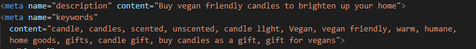

# CandleKeep

 ## Project overview
CandleKeep is an ecommerce application designed to enable a small one-person business to sell handmade candles via there own ecommerce website. 
You can view the deployed site [here](https://candlekeep-pp5.herokuapp.com/).

## Agile
User stories where use used to inform the scope and functionality need for this project as well as using Kanban board in git hub projects the track the progress of features as they get developed and implemented

## Strategy
* Goals
    * Site owner goals
        * To sell their hand made candles on their own ecommerce store.
        * To display images of their products.
        * To be able to add, edit and delete products
        * To make product sales through the website
        * To have a clean easy to use and navigate website. 
        * To interact with there user through blogs, reviews, newsletter.
    * Customer goals:
        * To find products easily that they would want to purchase.
        * For the site to have clear and easy navigation
        * To be able to review their purchase before fulfilling payment.
        * To be able to edit and update their purchase before fulfilling payment.
        * To leave reviews of products.
        * To update, edit and delete their Reviews.
## BUSSINESS MODEL
    * This business is a small independent store that operates on a B2C bases. The store is intended to be a secondary income for the store owner to make small profits from their      hobbyist candle making. 
    A real world example would be a small Etsy store owner that wanted more control over there website and profits
## Marketing
    * As a small business thier main marketing strategy would be to utilise a business Facebook page and the owners Facebook friends network to promote there store.
        As the candles are vegan and ethically sourced, they could also target Facebook groups with similar views and ethics to sell their goods to. A mock Facebook page can be seen [here](readme_docs/images/facebook_template/facebook_template.png)
## SEO
    * The site has a meta description and key words that are relevant to the sites product and goals and should help with SEO.
     
    
     
    The site has a sitemap.xml and a robots.txt file in the route directory
    Although the site has a minimalist approach in its design and layout the addition of an about page enables the owner of the store to write about their store and goals without obstructing the flow, quality and usability of the main site. The text here has been optimised to promote key words and searchability without detracting from the quality and message of the text. 
    There was also opportunity to share links to high-ranking external sites with relevant information
    The blog page is also a great place for the site owner to update the users and keep relevant and up to date information the page. 
## Structure
    * The site has been built with 7 apps(including the sites main app)  that each deals with a different area of the stores core functionality. 
    From a UX design point of view the site is structured so the user can easily and intuitively move from finding the right product to purchase and completing check out. Meeting the primary goal of both the site owner and the customer.
        1. This is achieved by having the shop now button take prominence on the home page then having clear and easy navigation to complete a purchase. 
        2. Once items have been added to the bag users can see the bag icon and total in the main navigation. This is standard practice across most ecommerce sites(for example amazon) so it will be intuitive for the user to click here to move to there bag. 
        3. Once one the shopping bag page the button to go to checkout it is clearly visible.
        4. The checkout page shows the user a clear summery of what they are going to purchase and strips payment form is clear for the user to see to complete their purchase 
* Database 
The data base schema can be seen [here](readme_docs/images/DB/db_schema.PNG).
SQLite was used for development and Postgres was used for my deployed site via Heroku.
* Data Models
Below is a list of models Used in this project
    * User: Django’s built in User model was used to store basic user
    * Product: a custom product model to store product details
    * Category: to create scented and unscented categories
    * Order: stores user data and delivery data 
    * OrderLineItem: stores individual product info for an order and binds the product to the order
    * Blog: stores the data for blogs created but the store admin
    * Review: stores user reviews
* Wire Frames
    The wire frames [here](readme_docs/images/wire_frames/candlekeep_wire_frames.png) show the basic design I wanted to work with for the site. 
    Keeping the sight clean and simple with clear navigation 
## Pages
    * Home page
    The wire frames below show the basic design I wanted to work with for the site. 
    Keeping the sight clean and simple with clear navigation
    [home_page](readme_docs/images/pages/home_page.PNG)
    * Products page:
    This page shows all products on the sight as a default. Using the search bar in the main navigation will show item that match the search criteria helping the user find the right item. The products are display in cards with name description and price of the product displayed for the user.  The user can click on these products to view them individually.
    [products_page](readme_docs/images/pages/product_page.PNG)
    * View product page:
    On this page a user sees a single card displaying the product information.
    There are also buttons for the user to return to the products page and keep shopping and to add items to their bag. The User can use the quantity input to choose how many candles they would like to buy. 
    When items are added to bag the total is added to the total in the nav bar
    This page also displays user Reviews below the product card. 
    Users that are not logged in can view these reviews. A logged in user add reviews and delete or edit reviews they have added.
    A user logged in as site admin sees buttons for editing and deleting product items.
    [view_products_page](readme_docs/images/pages/veiw_product_page_reviews.PNG)
    * Bag:
    The bag page displays an itemised summery of the items stored in the shopping bag in a table. The user can view what they are purchasing clearly. An image of the item is displayed at mid to small sizes and is removed at smaller sizes. The table also displays the name price and quantity of the item they are buying along with a subtotal and grand total. There is a button to remove items if the user wishes to do so.
    The user can user the go to check out button to continue to check out or use the continue shopping button to continue shopping. 
    [bag_page](readme_docs/images/pages/bag_page.PNG)
    * Checkout:
    This page displays an itemized summery again and simple check out form so the user can create an order. At the bottom of the form the user can then use stipe payment for there card details and complete their order
    There is also a button for the user to edit their bag if they want to make any changes.
    [checkout](readme_docs/images/pages/checkout_page_top.PNG)
    [checkout bottem](readme_docs/images/pages/checkout%20page%20bottem.PNG)
    * Checkout success:
    This page displays a message confirming checkout was successful. A link to the blog is also added here to encourage user to checkout that page.
    The order number is displayed here as well as a table confirming delivery details.
    [checkout success](readme_docs/images/pages/checkout_success_page.PNG)
    * About:
    This page consists of a card section with information about the company some user may find interesting. It contains key word information in strong tags to help with SEO.
    It also contains a sign-up section for a newsletter
    The page also has a call to action in the form of a shop now button under the title.
    [About](readme_docs/images/pages/about_page.PNG)
    * Blog:
    The blog page displays cards in a single column they show the blog content. The cards contain a title, body and date and time posted. 
    If sight admin is logged in that can see a button to add a blog. On the card sight admin will see edit and delete buttons.
    [blog](readme_docs/images/pages/blog_page.PNG)
    * Add blog:
    This page sees a small form where sight admin can add now blogs to the site.
    They can add a title and body content for the blog then click add blog to add the blog. They can also use the cancels button to cancel and return to the blog page.
    [add blog](readme_docs/images/pages/add_blog_page.PNG)
    * Edit blog:
    The site admin can see the same form ad the add blog page but it is prefilled with the original content to edit. They have 2 buttons cancel and Edit blog.
    [edit blog](readme_docs/images/pages/edit_blog_page.PNG)
    * Add product:
    This page has the add product for displayed. The site admin can add a product and all its details to this form. They can upload an image for the product. If no image is added. A placeholder image will be shown where the product is displayed around the sight.  Buttons to add product and cancel are at the bottom of this form.
    [Add product](readme_docs/images/pages/add_product_page.PNG)
    * Edit product.
    This page displays a form prefilled with the product information to be edited. A site admin can edit a product from this page then use the edit product button to submit changes or cancel using the cancel button. 
    [edit product](readme_docs/images/pages/edit_product_page.PNG)
    * Add Review:
    This page sees a small form where users can add new reviews to the site.
    They can add a title and body content for the review then click add review to add the review. They can also use the cancels button to cancel.
    [add review](readme_docs/images/pages/add_review_page.PNG)
    * Edit Review:
    The user can see the same form as  the add review page but it is prefilled with the original content to edit. They have 2 buttons cancel and Edit review.
    [edit review](readme_docs/images/pages/edit_review_page.PNG)
    * Login/logout/sign up pages all use the base allauth templates with some bootstrap css to make them look cleaner for the user.
## Design choices 
All the colours in use on this site were picked using https://imagecolorpicker.com/en.  the colours where taken from the background image that is used site wide. 
    * Overlay color = rgba(217,200,191,0.6) this colour was picked from the background of the man image and user as an over to mute the image and help make text pop. 
    * Title font colour #2a0406; this shade was also picked from the background image. It is only used sparingly for the sight name and some title. The colour is very subtle and is a barely noticeable touch that brings the sight together without the user even realising.
    Two google fonts were used for the title ‘Montserrat Alternates’ and ‘Work Sans’
    These font work well together and give the log text a unique feel.
## user stories 
* as a user I would like clear navigation so that I can intuitively navigate the site
* as a user I can see if I am singed into the site
* as a user confirmation message appear to confirm my choices 
* as a user I can search for products so I can find the products I want
* as a user I can access a list of all products that I can browse.
* As a user I can add an item to a shopping bag.
* As a user I can change the quantity of items I add to a shopping bag
* As a user I want to sign into my account
* As I user I want to sign out of my account
* As a user I want to register for an account 
* As I user I want to see what is in my bag clearly.
* As a user I wan to know how much my bag costs
* As user I want to edit my shopping bag
* As a user I want to checkout once I am happy with my items
* As a user I want confirmation that my order has been placed.
* As a user I want to see a review of products
* As I user I want to leave a review of products.
* As a user I want to edit my review
* As a user I want to delete my review
* As a user I want to sign up for a newsletter
* As a user I would like to see more information about the site
* As a admin user I would like to add products to the sight
* As an admin user I would like to edit products.
* As an admin user I would like to delete products
* As an admin user I would like to create a site blog
* As an amin user I would like to edit blog posts
* As an admin user I would like to delete blog posts. 

## guest/user/admin user
there are 3 types of user on this site with different permissions guest users, logged in users and admin users. 
* users can search for items add them to them to a bag and checkout without logging in
* logged in users can add, edit and delete reviews.
* Logged in admin users can add, edit and delete products and blogs on the site.

## features
* header/nav
    * The header has main navigation 
    * The header has displays user name when logged in. 
    * The header displays the current bag total in a bag link
    * The header contains a search bar for users to search for products.
tests
    * all links where tested and worked
    * search bar was tested with valid and invalid search terms
    * nave bar diplaying user name when loged in [navtest](readme_docs/images/tests/navtest.png)
    * nav bar displaying updated totp for bag   [navtest](readme_docs/images/tests/navtest.png)
* Footer
    * This is a basic footer to close of the page and has copy right text
* home page
    * The home page is vey simple with a call to action button that links to the product page a tag line and the background image acting as a hearo image. 
    * At smaller screen sizes this image changes to an image better suited to smaller screens
tests 
    * BUTTON LINK WAS TESTED AND WORKED

* products page
    * The page has a title and displays products in cards that link to the view product page for the product that is clicked.
test
    * as can been seen on the page image above the cards display properly for mutiple cards/ image tupes
    * as can be seen on the page image above producs with out images display a place holder image
* view product page
    *  Here you can add the desired quantity of product to you bag. 
    * An admin user accesses the edit button and delete button
    * A logged in user can access the add review, edit and delete review buttons
    * Product reviews are visible to all users here
tests
    * as can be seen on the page image above idividual producs are displayed here
    * all links and buttons have been tested and direct to the correct place
    * the rview cards all display as inteded

* add products
    * These is a form that an admin user can submit to add a product
tests
    * all products seen on the products image page where ded manualy.
    * all buttons where tested and worked
    * when not logged in as admin admin only buttons can not be seen. [link](readme_docs/images/tests/admin_only_buttons.PNG)
* edit products
    * These is a form on this page an admin user can user to edit a product
    * as can be seen on the edit page image above the from is pre filled.
    here is the same prodict edited [link](readme_docs/images/tests/edited_product.PNG)

* add review page
    * There is a form on here that a logged in user can user to submit a product review
tests
    * all links have been tested on this page.
    * all reviews on the live site where created using the add review form and ll worked as inteded.
* edit review page
    * There is a form on this page a logged in user can user to edit a review they published
    * review form is populted with the correct info [link](readme_docs/images/pages/edit_review_page.PNG)
* Bag
    * Users can view a summary of the items thy have and a grand total of the price
    * They can remove an item if they with
    * They can continue to shop vie the continue shopping button
    * They can go to check out with the checkout button
tests
    * all bag items are displayed properly [link](readme_docs/images/pages/bag_page.PNG)
    * total and grand total displyed correctly [link](readme_docs/images/pages/bag_page.PNG)
    * remove item button works and is tested 
* checkout page
    * This page contains a form to input user details to create an order.
    * It has strip payments 
    * There is a summery of the bag contents.
* checkout success
    * Contains a message confirming checkout success 
    * Displays the order number and delivery details
    * A link to the blog page.
* blog page
    * Users are able to see blog posts on this page.
    * Admin user can see buttons to add edit and delete blog posts.
* add blog page
    * There is a form admin user can user to adda blog post 
    * A button to submit the form
    * A button to cancel the form
* edit blog page
    * These is a prefilled for admin user can add it to update and change a blog post
    * The is a submit button for the blog post
    * There is a cancel button 
* auth pages
    * This site use Allauth templates for it login pages sign up pages and logout pages.
    * They have been styles with Bootstrap and CSS to fit with the aesthetic 
* 404 page
    * A custom 404 page has been made with a link to direct users bk to the home page

## Technologies
* Tech stack
    * CSS
    * JS
    * Python
    * HTML
    * Bootstr
    * jQuery
* Other tech
    * Google Fonts
    * Font Awsume
    * Color picker
    * Strip payments
    * AWS
    * Balsamic Wireframes
    * https://favicon.io/favicon-generator/

## Testing other testing
results from https://validator.w3.org/ home page [here](https://validator.w3.org/nu/?showsource=yes&doc=https%3A%2F%2Fcandlekeep-pp5.herokuapp.com%2F)
results from https://validator.w3.org/ checkout [here](results from https://validator.w3.org/ home page [here](https://validator.w3.org/nu/?showsource=yes&doc=https%3A%2F%2Fcandlekeep-pp5.herokuapp.com%2Fcheckout%2F#l129c10)
results from https://validator.w3.org/ bag page[here](https://validator.w3.org/nu/?showsource=yes&doc=https%3A%2F%2Fcandlekeep-pp5.herokuapp.com%2Fbag%2F#l129c10)
results from https://validator.w3.org/ view products page[here](https://validator.w3.org/nu/?showsource=yes&doc=https%3A%2F%2Fcandlekeep-pp5.herokuapp.com%2Fproducts%2F#l129c10)
result from https://jigsaw.w3.org/ [here](https://jigsaw.w3.org/css-validator/validator?uri=https%3A%2F%2Fcandlekeep-pp5.herokuapp.com%2Fcheckout%2F&profile=css3svg&usermedium=all&warning=1&vextwarning=&lang=en)
python code was tested useing pep8 in git pod

    there where some issues with hythons in commets used to add descriptions but no errors in the code.

## deployment
### Forking the GitHub Repository

* Access your GitHub account and find the repository you want to fork.
* Click on 'Fork' on the top right of the page.
* You will find a copy of the repository in your own Github account.
### Making a Local Clone
* Access your GitHub account and find the repository you want to clone.
* Click the 'Code' button next to 'Add file'.
* To clone the repository using HTTPS, under clone with HTTPS, copy the link.
* Open Git Bash.
* Access the directory you want the clone to be have.
* In your IDE's terminal type 'git clone' and the paste the URL you copied.
* Press Enter.

## Heroku
This application has been deployed from Github using Heroku. the steps i follow are below:

* Create an account at heroku.com
* Create a new app, add app name and your region
* Click on create app
* Go to "Settings"
* Under Config Vars, add your sensitive data
* Go to "Deploy" and at "Deployment method", click on "Connect to Github"
* search for your repositry name and click it
* Choose the branch you want to buid your app from
* clicking on "Enable Automatic Deploys",will keep the deplyment up to date with your pushes to git

## AWS S3
The deployed version of this website has static(CSS and JavaScript) and media files hosted to it via a web based service called Amazon Web Services S3 Bucket.

folow the steps below* :

* Create an account at aws.amazon.com
* Navigate to the IAM application and create a user and group
* Set the AmazonS3FullAccess for the user and copy the AWS ACCESS and SECRET keys as config vars to your workspace and deployment environment
* Create a new Bucket within the S3 application with an appropriate name.
* Enable public access for your bucket so users can access and use the services on your website. More info can be read in the official documentation: https://aws.amazon.com/s3/

## Accessibility
    all pages passed like house check for accessibility, perfomance and SEO [example1](readme_docs/images/lighthouse/home_page.PNG) [emample2](readme_docs/images/lighthouse/products_page.PNG) [emample3](readme_docs/images/lighthouse/vierw_product.PNG

## credits

### media
    * Red-chery - https://pixabay.com/photos/candle-christmas-advent-light-4720004/
    * Background image- https://www.pexels.com/photo/a-person-holding-a-candle-in-a-glass-jar-7020006/
    * Pine - https://pixabay.com/photos/christmas-candle-decoration-holiday-2930915/
    * Bamboo - https://pixabay.com/photos/candle-bamboo-flame-flower-1021137/
    * Bg-img-sm https://www.pexels.com/photo/a-person-holding-a-candle-7020051/

### acknowledgements
 i would like to thank my mentor for all the help in all my projects

